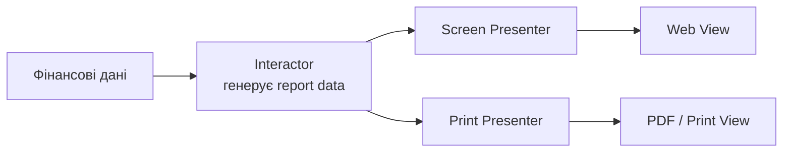
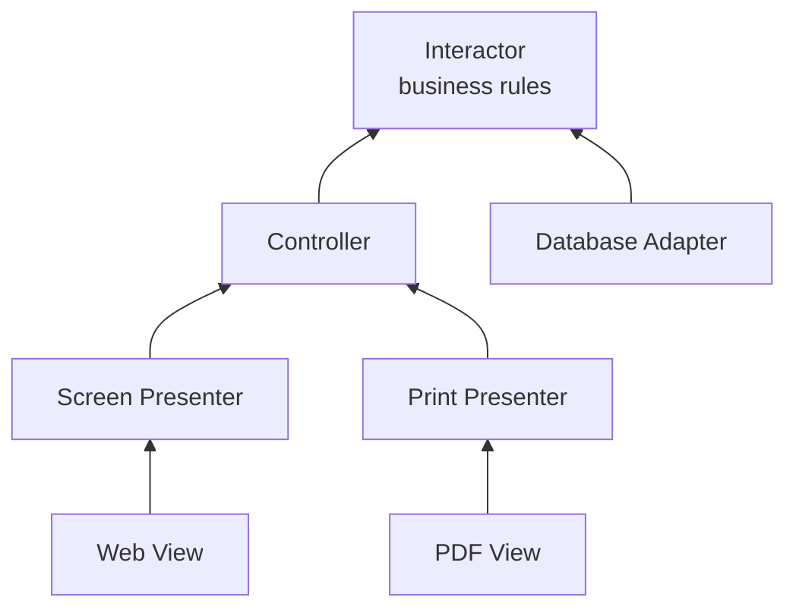

# Принцип відкритості-закритості

## Контекст

- Джерело: [[01-Sources/books/clean-architecture/Clean Architecture (Robert C. Martin)|Clean Architecture]]
- Розділ: 8
- Тип джерела: уривок

## Головна ідея

У цьому розділі Роберт Мартін показує, що `OCP` є не лише правилом дизайну класів, а одним із головних мотивів архітектури систем загалом. Ідея проста: якщо нова вимога змушує масово переписувати старий код, то архітектура провалилася. Правильне застосування `SRP` і `DIP` дозволяє розкласти систему на компоненти так, щоб нову поведінку можна було додавати через нові компоненти й нові залежності, не пробиваючи змінами найцінніше ядро бізнес-правил.

^clean-architecture-ch08-main-idea

## Ключові тези

- `Open-Closed Principle` означає, що software artifact має бути відкритим для розширення, але закритим для модифікації: поведінка має розширюватися без переписування самого артефакта. ^clean-architecture-ch08-thesis-definition
- На архітектурному рівні `OCP` спирається на попередні принципи: спершу ми розділяємо різні причини змін через `SRP`, а потім організовуємо залежності через `DIP`, щоб розширення не текло в центр системи. ^clean-architecture-ch08-thesis-srp-dip
- У thought experiment нова вимога з друком фінансового звіту не повинна змушувати переписувати генератор фінансових даних; presentation logic для web і print має бути окремою відповідальністю. ^clean-architecture-ch08-thesis-thought-experiment
- Архітектурна форма `OCP` досягається partitioning-ом у компоненти з односторонніми залежностями: нижчі за рівнем компоненти залежать від вищих, якщо ми хочемо захистити вищі від змін у нижчих. ^clean-architecture-ch08-thesis-unidirectional
- Найкраще захищеним компонентом має бути `Interactor`, бо саме він містить highest-level policies і business rules, тоді як `Controller`, `Presenters`, `Views` та `Database` лишаються периферією. ^clean-architecture-ch08-thesis-interactor
- Інтерфейси на кшталт `FinancialDataGateway` або `FinancialReportPresenter` існують не заради "чистоти UML", а заради directional control: вони інвертують залежності так, щоб policy не залежала від деталей. ^clean-architecture-ch08-thesis-directional-control
- Інтерфейс `FinancialReportRequester` виконує ще одну роль - information hiding: він не дозволяє `Controller` отримати транзитивну залежність на внутрішні сутності `Interactor`. ^clean-architecture-ch08-thesis-information-hiding

## Опорні схеми

- Figure 8.1: на рівні data flow генерація financial data і її presentation для web та print розведені як окремі відповідальності; це початкове застосування `SRP` до задачі розширення. ^clean-architecture-ch08-figure-data-flow
- Figure 8.2: процеси розбиті на класи й компоненти (`Controller`, `Interactor`, `Database`, `Presenters`, `Views`), а інтерфейси `<I>` і data structures `<DS>` формують точний напрямок залежностей. ^clean-architecture-ch08-figure-components
- Figure 8.3: компонентний граф показує односторонні зв'язки; стрілки спрямовані до тих компонентів, які ми хочемо захистити від змін. ^clean-architecture-ch08-figure-unidirectional

## Спрощені схеми

### 1. Розширення presentation без зміни ядра



Ця схема стискає thought experiment до головного: новий канал виводу додається як новий presenter/view, а не як причина переписувати `Interactor`. ^clean-architecture-ch08-simple-diagram-extension

### 2. Ієрархія захисту через напрямок залежностей



Чим вище компонент у цій схемі, тим сильніше ми хочемо його захистити. Саме тому стрілки йдуть у бік `Interactor`, а не від нього назовні. ^clean-architecture-ch08-simple-diagram-protection

## Практичні правила

- Визначай, який компонент містить highest-level policy, і підпорядковуй йому всі нижчі деталі через напрямок залежностей.
- Новий канал presentation або новий storage-драйвер має додаватися як extension-компонент, а не як причина переписувати бізнес-правила.
- Якщо lower-level компонент прямо імпортує або "просвічує" внутрішності higher-level компонента, це руйнує не лише `DIP`, а й архітектурний сенс `OCP`.
- Інтерфейси створюй там, де вони реально захищають policy або приховують внутрішню будову, а не як формальність.

## Мінімальний приклад

```java
public interface FinancialReportPresenter {
    void present(ReportData data);
}

public final class FinancialReportInteractor {
    private final FinancialReportPresenter presenter;

    public FinancialReportInteractor(FinancialReportPresenter presenter) {
        this.presenter = presenter;
    }

    public void generate(ReportData data) {
        presenter.present(data);
    }
}

public final class PrintReportPresenter implements FinancialReportPresenter {
    public void present(ReportData data) {
        renderPdf(data);
    }
}
```

`Interactor` не змінюється, коли ми додаємо новий формат виводу. Розширення відбувається через новий presenter, тобто за межами high-level policy. Це і є найкоротше читання `OCP` у стилі цього розділу. ^clean-architecture-ch08-minimal-code-example

## Розгорнутий приклад

### Фрагмент 1: стабільна policy

```java
public record ReportData(String title, BigDecimal revenue) {}

public interface FinancialReportPresenter {
    void present(ReportData data);
}

public final class FinancialReportInteractor {
    private final FinancialDataGateway gateway;
    private final FinancialReportPresenter presenter;

    public FinancialReportInteractor(
        FinancialDataGateway gateway,
        FinancialReportPresenter presenter
    ) {
        this.gateway = gateway;
        this.presenter = presenter;
    }

    public void generateReport() {
        ReportData data = gateway.fetchReportData();
        presenter.present(data);
    }
}
```

^clean-architecture-ch08-code-ocp-stable-policy

### Фрагмент 2: нове розширення

```java
public final class WebReportPresenter implements FinancialReportPresenter {
    public void present(ReportData data) {
        renderHtml(data);
    }
}

public final class PrintReportPresenter implements FinancialReportPresenter {
    public void present(ReportData data) {
        renderPdf(data);
    }
}
```

^clean-architecture-ch08-code-ocp-new-presenter

`FinancialReportInteractor` знає лише про контракт `FinancialReportPresenter`, тому новий канал виводу додається як новий клас, а не як нова `if/else`-гілка всередині policy. Саме це і показує архітектурний сенс `OCP`: бізнес-ядро лишається стабільним, а поведінка розширюється на периферії.

У цьому прикладі `PrintReportPresenter` не "вламується" в interactor. Він просто підлаштовується під уже наявний контракт. Завдяки цьому додавання `PDF` або друку не змушує редагувати алгоритм побудови звіту.

## Важливі цитати

> A software artifact should be open for extension but closed for modification.

^clean-architecture-ch08-quote-definition

> If component A should be protected from changes in component B, then component B should depend on component A.

^clean-architecture-ch08-quote-protection

## Пов'язані концепти

- [[02-Concepts/open-closed-protects-high-level-policy|OCP захищає high-level policy через ієрархію залежностей]]
- [[02-Concepts/dependency-inversion|Інверсія залежностей]]
- [[02-Concepts/single-responsibility-means-one-actor|SRP означає одного актора, а не одну дію]]
- [[02-Concepts/architecture-governs-cost-of-change|Архітектура визначає вартість змін]]

## Джерело та продовження

- [[01-Sources/books/clean-architecture/Clean Architecture (Robert C. Martin)|Нотатка книги]]
- [[01-Sources/books/clean-architecture/02-Chapters/ch-07-single-responsibility-principle|Попередній розділ: Принцип єдиної відповідальності]]

## Пов'язані нотатки

- [[02-Concepts/open-closed-protects-high-level-policy#^open-closed-protects-high-level-policy-definition|Спільний концепт про OCP як захист high-level policy]]
- [[02-Concepts/dependency-inversion#^dependency-inversion-definition|Спільний концепт про інверсію залежностей]]
