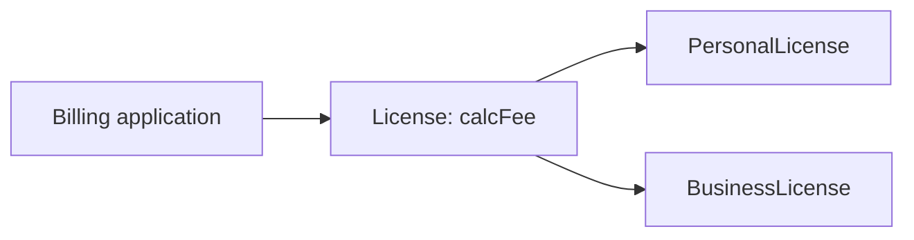
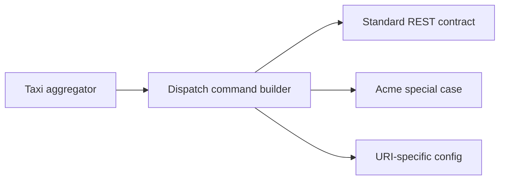
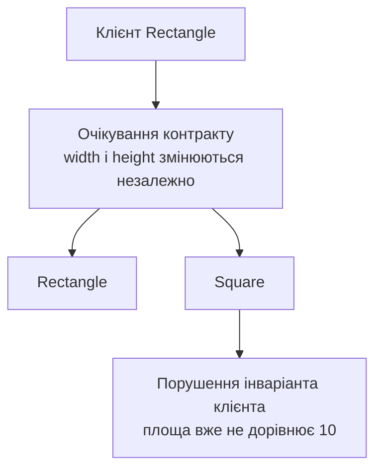

# Принцип підстановки Лісков

## Контекст

- Джерело: [[01-Sources/books/clean-architecture/Clean Architecture (Robert C. Martin)|Clean Architecture]]
- Розділ: 9
- Тип джерела: уривок

## Головна ідея

`LSP` вимагає, щоб підтип можна було підставити замість базового типу без зміни спостережуваної поведінки клієнтського коду. У розділі Мартін показує, що це не вузьке правило про спадкування класів, а архітектурна вимога до будь-яких контрактів: якщо одна реалізація поводиться "майже так само", але змушує клієнтів додавати особливі випадки, перевірки типів або конфігураційні обхідні механізми, то взаємозамінність зламана, а архітектура починає обростати зайвою складністю.

^clean-architecture-ch09-main-idea

## Ключові тези

- Класичне формулювання Барбари Лісков зводиться до поведінкової сумісності: для всіх програм, написаних проти типу `T`, заміна об'єкта `T` на об'єкт підтипу `S` не повинна змінювати поведінку програми. ^clean-architecture-ch09-thesis-definition
- Приклад з `License`, `PersonalLicense` і `BusinessLicense` демонструє коректну підстановку: клієнт `Billing` викликає `calcFee()` і не залежить від конкретного алгоритму обчислення. ^clean-architecture-ch09-thesis-license
- Проблема `Square/Rectangle` порушує `LSP`, бо клієнт `Rectangle` очікує незалежну зміну ширини й висоти, а `Square` не може зберегти цю поведінку без прихованих побічних ефектів. ^clean-architecture-ch09-thesis-square-rectangle
- Порушення `LSP` майже завжди видає себе тим, що клієнт мусить знати про "особливий" підтип або implementation-specific правило, щоб працювати коректно. ^clean-architecture-ch09-thesis-special-cases
- На архітектурному рівні `LSP` стосується не лише класів, а будь-яких контрактів: інтерфейсів, duck-typed API, сервісів і REST endpoints. ^clean-architecture-ch09-thesis-architecture
- Історія з taxi dispatch показує, що навіть маленька несумісність у полі `destination` проти `dest` змушує систему заводити винятки, конфігураційні таблиці й додаткові механізми маршрутизації команд. ^clean-architecture-ch09-thesis-taxi
- Отже, порушення substitutability забруднює архітектуру не тільки локальними `if`, а й новими шарами інфраструктури, які існують лише для обходу несумісних реалізацій. ^clean-architecture-ch09-thesis-pollution

## Опорні приклади

- Figure 9.1: `License` та його похідні з різними алгоритмами `calcFee()` задовольняють `LSP`, бо `Billing` не змінює поведінку залежно від підтипу. ^clean-architecture-ch09-figure-license
- Figure 9.2: `Square` не є коректним підтипом `Rectangle`, якщо контракт `Rectangle` допускає незалежне налаштування висоти й ширини. ^clean-architecture-ch09-figure-square
- Taxi dispatch example: REST-сервіси мають однакову форму URI, але одна компанія змінює назву поля на `dest`, і це руйнує взаємозамінність сервісів для агрегатора. ^clean-architecture-ch09-figure-taxi

## Спрощені схеми

### 1. Коректна підстановка



Клієнтський код працює через спільний контракт `License` і не потребує знати, який саме subtype обчислює комісію. ^clean-architecture-ch09-simple-diagram-license

### 2. Архітектурна ціна порушення



Щойно одна реалізація перестає бути взаємозамінною, клієнт або проміжний шар мусить брати на себе знання про відмінності між провайдерами. ^clean-architecture-ch09-simple-diagram-pollution

### 3. Де саме ламається `Square/Rectangle`



`Square` може мати ту саму поверхневу форму API, але не зберігає поведінковий контракт, на який спирається клієнт `Rectangle`. ^clean-architecture-ch09-simple-diagram-square-break

## Практичні правила

- Формулюй контракт через очікувану поведінку клієнта, а не лише через однакові назви методів або полів.
- Якщо нова реалізація потребує `instanceof`, перевірки домену, флагів або таблиці винятків у клієнті, розглядай це як сильний сигнал порушення `LSP`.
- Не роби підтип із типу, чий інваріант слабший або інший за контракт базового типу; у таких випадках краще виділити окрему абстракцію.
- На рівні сервісів і API перевіряй не лише форму endpoint, а й однаковість семантики: назви полів, допустимі стани, коди помилок і гарантії мають лишатися сумісними.
- Архітектурний "обхід" несумісностей через конфігурації чи адаптери може бути потрібним тактично, але його варто трактувати як компенсацію за зламаний контракт, а не як норму.

## Мінімальний приклад

```java
Rectangle r = factory.create();
r.setW(5);
r.setH(2);
assert(r.area() == 10);
```

Якщо `factory.create()` поверне `Square`, клієнтський інваріант зламається: виклики `setW` і `setH` більше не є незалежними, а значить об'єкт не поводиться як очікуваний `Rectangle`. Це і є найкоротший тест на порушення `LSP`. ^clean-architecture-ch09-minimal-code-example

## Важливі цитати

> If for each object o1 of type S there is an object o2 of type T such that for all programs P defined in terms of T, the behavior of P is unchanged when o1 is substituted for o2 then S is a subtype of T.

^clean-architecture-ch09-quote-liskov

> Since the behavior of the User depends on the types it uses, those types are not substitutable.

^clean-architecture-ch09-quote-user

## Пов'язані концепти

- [[02-Concepts/liskov-substitution-preserves-client-behavior|LSP зберігає поведінку клієнта при підстановці]]
- [[02-Concepts/open-closed-protects-high-level-policy|OCP захищає high-level policy через ієрархію залежностей]]
- [[02-Concepts/dependency-inversion|Інверсія залежностей]]
- [[02-Concepts/solid-organizes-modules-for-change|SOLID організовує модулі для змінюваності]]

## Пов'язані приклади коду

- Окрему code note для `Square/Rectangle` ще не додано; мінімальний приклад зафіксований у цій chapter-note.

## Джерело та продовження

- [[01-Sources/books/clean-architecture/Clean Architecture (Robert C. Martin)|Нотатка книги]]
- [[01-Sources/books/clean-architecture/02-Chapters/ch-08-open-closed-principle|Попередній розділ: Принцип відкритості-закритості]]
- [[01-Sources/books/clean-architecture/02-Chapters/ch-10-interface-segregation-principle|Наступний розділ: Принцип розділення інтерфейсів]]

## Пов'язані нотатки

- [[02-Concepts/liskov-substitution-preserves-client-behavior#^liskov-substitution-preserves-client-behavior-definition|Спільний концепт про поведінкову підстановність]]
- [[02-Concepts/open-closed-protects-high-level-policy#^open-closed-protects-high-level-policy-definition|OCP на архітектурному рівні]]
