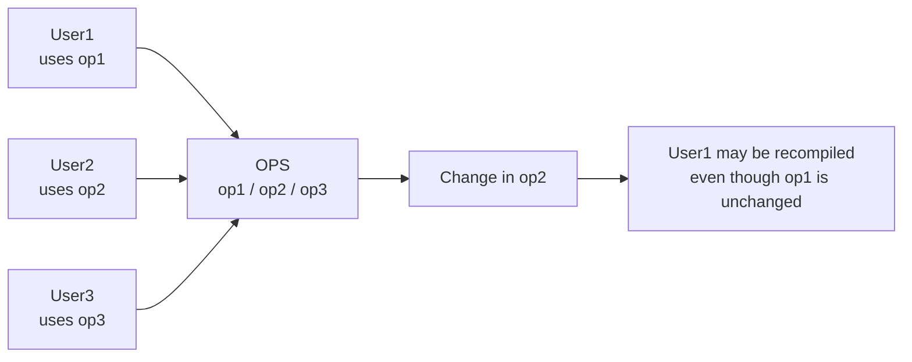
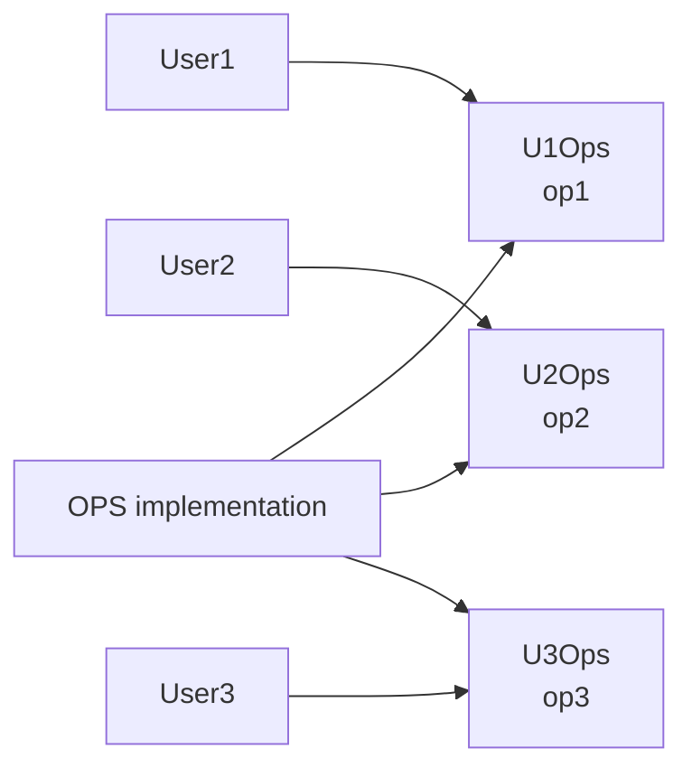
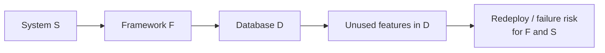

# Принцип розділення інтерфейсів

## Контекст

- Джерело: [[01-Sources/books/clean-architecture/Clean Architecture (Robert C. Martin)|Clean Architecture]]
- Розділ: 10
- Тип джерела: уривок

## Головна ідея

`ISP` вимагає, щоб кожен клієнт залежав лише від тих операцій, які він справді використовує. У розділі Мартін починає з класичного прикладу "товстого" інтерфейсу `OPS`, де різні користувачі викликають різні методи, але все одно змушені імпортувати один і той самий пакет декларацій. Проте справжня вага принципу розкривається ширше: проблема не зводиться до ключового слова `interface` чи навіть до `OOP`, а до будь-якої залежності, яка тягне в систему зайвий багаж, зайві зміни або зайві точки відмови.

^clean-architecture-ch10-main-idea

## Ключові тези

- Якщо `User1` використовує тільки `op1`, його код не повинен залежати від декларацій `op2` і `op3`; у статично типізованих мовах така зайва залежність може спричинити непотрібну перекомпіляцію та перевипуск. ^clean-architecture-ch10-thesis-static-deps
- Розбиття одного широкого контракту на вузькі інтерфейси на кшталт `U1Ops`, `U2Ops` і `U3Ops` відокремлює клієнтів від змін, які для них не мають значення. ^clean-architecture-ch10-thesis-segregated-interfaces
- У динамічно типізованих мовах тиск на рівні вихідного коду менший, бо декларації не імпортуються явно, але це не скасовує сам принцип. ^clean-architecture-ch10-thesis-dynamic-languages
- Глибинний мотив `ISP` архітектурний: шкідливо залежати від модуля, який містить більше, ніж тобі потрібно, навіть якщо проблема не проявляється як компіляторна залежність. ^clean-architecture-ch10-thesis-architecture
- Приклад `S -> F -> D` показує, що фреймворк або бібліотека може протягнути в систему небажані залежності на чужі фічі, їхні деплойти та їхні збої. ^clean-architecture-ch10-thesis-baggage
- Отже, `ISP` варто читати як дисципліну про мінімально потрібні контракти, а не лише як пораду "не робіть великих інтерфейсів". ^clean-architecture-ch10-thesis-minimal-contracts

## Опорні приклади

- Figure 10.1: один клас `OPS` містить `op1`, `op2` і `op3`, але різні користувачі залежать лише від окремих операцій; через спільну декларацію вони все одно виявляються зчепленими. ^clean-architecture-ch10-figure-ops
- Figure 10.2: після виділення `U1Ops`, `U2Ops` і `U3Ops` кожен клієнт залежить від свого вузького контракту, а не від повного набору операцій `OPS`. ^clean-architecture-ch10-figure-segregated
- Figure 10.3: система `S` залежить від фреймворку `F`, який, своєю чергою, прив'язаний до бази `D`; навіть невикористані можливості `D` стають джерелом змін і ризику для всієї системи. ^clean-architecture-ch10-figure-framework

## Спрощені схеми

### 1. Широкий інтерфейс створює зайві залежності



Одна спільна декларація примушує клієнтів платити за зміни в операціях, які вони навіть не викликають. ^clean-architecture-ch10-simple-diagram-fat-interface

### 2. Сегрегація вирівнює залежності під ролі клієнтів



Після сегрегації реалізація може лишатися спільною, але клієнти імпортують тільки потрібні їм контракти. ^clean-architecture-ch10-simple-diagram-segregated

### 3. Архітектурний багаж передається транзитивно



`ISP` попереджає не лише про "товсті" інтерфейси класів, а й про транзитивний багаж у бібліотеках, фреймворках і платформах. ^clean-architecture-ch10-simple-diagram-architecture

## Практичні правила

- Формуй інтерфейси навколо конкретного клієнта, ролі або use case, а не навколо "всього, що вміє сервіс".
- Якщо зміна одного методу змушує перевіряти або перебудовувати клієнтів, які цей метод не використовують, контракт, імовірно, занадто широкий.
- Не плутай реалізацію з контрактом: одна реалізація може підтримувати кілька вузьких інтерфейсів без потреби виставляти клієнтам усі методи одразу.
- На архітектурному рівні ховай важкі фреймворки, SDK і драйвери за портами, фасадами або адаптерами, якщо ядру системи потрібен лише малий фрагмент їхньої поведінки.
- Динамічна типізація може зменшити compile-time coupling, але не прибирає проблеми зайвих залежностей, зайвих збоїв і зайвої складності.

## Мінімальний приклад

```java showLineNumbers
public interface U1Ops {
    void op1();
}

public interface U2Ops {
    void op2();
}

public final class User1 {
    private final U1Ops ops;

    public User1(U1Ops ops) {
        this.ops = ops;
    }

    public void run() {
        ops.op1();
    }
}
```

Тепер `User1` не має жодної причини знати про `op2`: зміни в іншому контракті не тягнуть за собою зайву залежність у коді клієнта. ^clean-architecture-ch10-minimal-code-example

## Важливі цитати

> In general, it is harmful to depend on modules that contain more than you need.

^clean-architecture-ch10-quote-harmful

> depending on something that carries baggage that you don’t need can cause you troubles that you didn’t expect.

^clean-architecture-ch10-quote-baggage

## Пов'язані концепти

- [[02-Concepts/interface-segregation-avoids-dependencies-on-unused-operations|ISP ізолює клієнтів від невикористаних операцій]]
- [[02-Concepts/solid-organizes-modules-for-change|SOLID організовує модулі для змінюваності]]
- [[02-Concepts/dependency-inversion|Інверсія залежностей]]
- [[02-Concepts/open-closed-protects-high-level-policy|OCP захищає high-level policy через ієрархію залежностей]]

## Пов'язані приклади коду

- Окрему code note для цього розділу ще не додано; мінімальний приклад зафіксований у цій chapter-note.

## Джерело та продовження

- [[01-Sources/books/clean-architecture/Clean Architecture (Robert C. Martin)|Нотатка книги]]
- [[01-Sources/books/clean-architecture/02-Chapters/ch-09-liskov-substitution-principle|Попередній розділ: Принцип підстановки Лісков]]
- [[01-Sources/books/clean-architecture/02-Chapters/ch-11-dependency-inversion-principle|Наступний розділ: Принцип інверсії залежностей]]

## Пов'язані нотатки

- [[02-Concepts/interface-segregation-avoids-dependencies-on-unused-operations#^interface-segregation-definition|Спільний концепт про ізоляцію клієнтів від непотрібних операцій]]
- [[02-Concepts/solid-organizes-modules-for-change#^solid-organizes-modules-for-change-definition|SOLID як набір правил для змінюваності модулів]]
