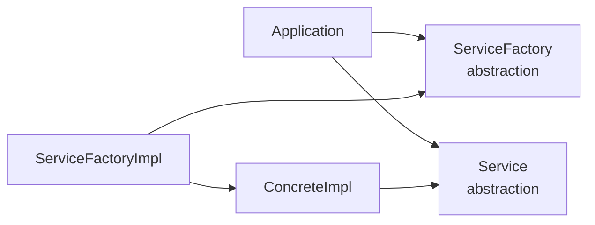
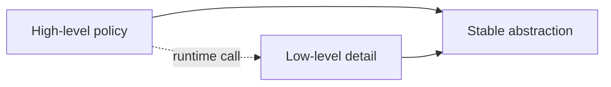
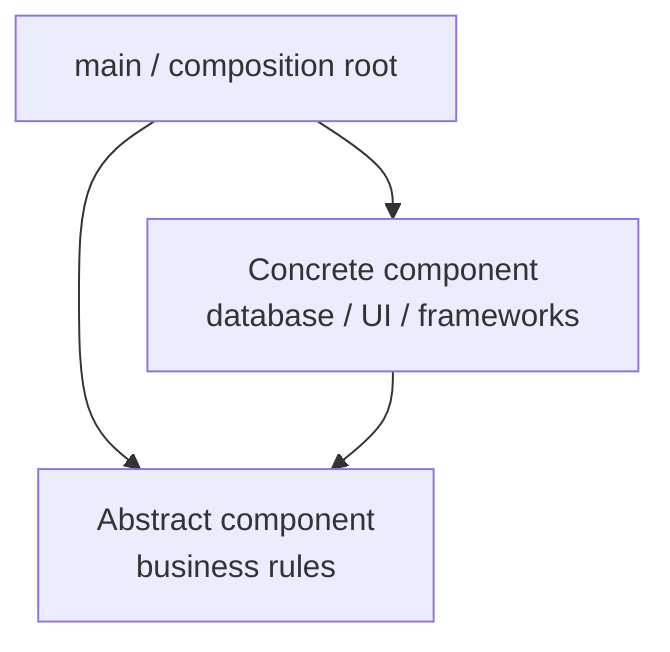

# Принцип інверсії залежностей

## Контекст

- Джерело: [[01-Sources/books/clean-architecture/Clean Architecture (Robert C. Martin)|Clean Architecture]]
- Розділ: 11
- Тип джерела: уривок

## Головна ідея

`DIP` вимагає, щоб залежності у вихідному коді були спрямовані до абстракцій, а не до конкретних і нестабільних реалізацій. Мартін наголошує, що мета принципу не в абстрагуванні "всього підряд", а в захисті high-level policy від volatile details, які змінюються найчастіше. Саме тому concrete dependencies не зникають повністю, але їх слід ізолювати на периферії системи, тоді як центр архітектури має говорити мовою стабільних контрактів.

^clean-architecture-ch11-main-idea

## Ключові тези

- Найгнучкіші системи мають такі залежності у коді, де модулі посилаються на інтерфейси, абстрактні класи або інші абстракції, а не на конкретні реалізації. ^clean-architecture-ch11-thesis-abstractions
- Не всі concrete dependencies однаково шкідливі: стабільні платформні елементи на кшталт `String` допустимі, бо їхня змінність низька й добре контрольована. ^clean-architecture-ch11-thesis-stable-background
- Небезпечними є саме volatile concretions, тобто деталі, які команда активно змінює під час розробки. ^clean-architecture-ch11-thesis-volatile-details
- Абстракції зазвичай стабільніші за реалізації: зміна інтерфейсу часто тягне зміни в усіх імплементаціях, тоді як зміна імплементації не обов'язково вимагає правок контракту. ^clean-architecture-ch11-thesis-stable-abstractions
- Звідси випливають практичні правила: не залежати від volatile concrete classes, не наслідувати їх, не перевизначати concrete functions і взагалі не тягнути в policy імена нестабільних деталей. ^clean-architecture-ch11-thesis-rules
- Створення об'єктів майже завжди вимагає знання concrete type, тому цю залежність варто локалізувати через `Abstract Factory` або composition root на кшталт `main`. ^clean-architecture-ch11-thesis-factories
- Архітектурна межа відділяє abstract component з бізнес-правилами від concrete component з деталями; усі source code dependencies мають перетинати цю межу в напрямку до абстракцій. ^clean-architecture-ch11-thesis-boundary
- Потік керування часто йде у протилежний бік до залежностей у коді, і саме ця інверсія пояснює назву принципу. ^clean-architecture-ch11-thesis-control-flow

## Опорні приклади

- `java.lang.String` є concrete class, але її стабільність робить таку залежність прийнятним винятком із правила. ^clean-architecture-ch11-example-string
- `Application` користується сервісом через `Service`, але створює concrete implementation не напряму, а через `ServiceFactory`, реалізований окремою concrete factory. ^clean-architecture-ch11-example-factory
- Curved boundary у схемі відокремлює abstract side від concrete side; через неї залежності в коді спрямовані в один бік, а control flow може проходити назад. ^clean-architecture-ch11-example-boundary
- Concrete component часто зосереджується в `main`: саме там збираються реальні реалізації, фабрики й конфігурація запуску. ^clean-architecture-ch11-example-main

## Спрощені схеми

### 1. Policy залежить від контракту, detail реалізує контракт



`Application` працює лише з `Service` і `ServiceFactory`, тоді як concrete класи залишаються по інший бік межі. ^clean-architecture-ch11-simple-diagram-abstractions

### 2. Потік керування й напрямок залежностей розходяться



Під час виконання сценарій іде від policy до detail, але залежність у коді не тягне policy назовні до технологічної реалізації. ^clean-architecture-ch11-simple-diagram-inversion

### 3. Concrete wiring живе на периферії



Порушення `DIP` не зникають повністю, але їх можна зібрати в невеликий concrete component, який займається складанням системи. ^clean-architecture-ch11-simple-diagram-main

## Практичні правила

- Формулюй контракти мовою use case-ів і бізнес-правил, а не мовою `ORM`, `HTTP client` чи конкретної бази даних.
- Не дозволяй volatile framework-ам, драйверам і SDK протікати в high-level policy через імпорти, типи повернення або винятки.
- Тримай `new`, конфігурацію й вибір конкретних реалізацій у `main`, composition root або фабриках, а не всередині use case-ів.
- Якщо абстракція змінюється частіше за реалізації, це сигнал, що контракт сформульовано невдало або занадто деталізовано.
- Терпи стабільні concrete залежності лише там, де їхня волатильність справді низька і вони не диктують форму бізнес-правил.

## Мінімальний приклад

```java
public interface Service {
    void execute();
}

public interface ServiceFactory {
    Service makeSvc();
}

public final class Application {
    private final ServiceFactory factory;

    public Application(ServiceFactory factory) {
        this.factory = factory;
    }

    public void run() {
        Service service = factory.makeSvc();
        service.execute();
    }
}
```

`Application` знає лише про `Service` і `ServiceFactory`. Конкретні `ServiceFactoryImpl` та `ConcreteImpl` можна змінювати, не пробиваючи залежність у центр policy. ^clean-architecture-ch11-minimal-code-example

## Важливі цитати

> source code dependencies refer only to abstractions, not to concretions.

^clean-architecture-ch11-quote-abstractions

> interfaces are less volatile than implementations.

^clean-architecture-ch11-quote-volatility

## Пов'язані концепти

- [[02-Concepts/dependency-inversion|Інверсія залежностей]]
- [[02-Concepts/open-closed-protects-high-level-policy|OCP захищає high-level policy через ієрархію залежностей]]
- [[02-Concepts/plugin-architecture-via-polymorphism|Поліморфізм дозволяє будувати plugin architecture]]
- [[01-Sources/books/clean-architecture/03-Concepts/oo-controls-dependency-direction-through-polymorphism|ООП дає контроль над напрямком залежностей через поліморфізм]]

## Пов'язані приклади коду

- [[01-Sources/books/clean-architecture/04-Code/dip-interactor-depends-on-gateway-contract|Interactor залежить від gateway-контракту, а не від Postgres]]

## Джерело та продовження

- [[01-Sources/books/clean-architecture/Clean Architecture (Robert C. Martin)|Нотатка книги]]
- [[01-Sources/books/clean-architecture/02-Chapters/ch-10-interface-segregation-principle|Попередній розділ: Принцип розділення інтерфейсів]]
- Із цього розділу напряму виростає [[02-Concepts/dependency-inversion|спільний концепт про інверсію залежностей]], який варто читати разом із прикладом порту й адаптера.

## Пов'язані нотатки

- [[02-Concepts/dependency-inversion#^dependency-inversion-definition|Спільний концепт про інверсію залежностей]]
- [[01-Sources/books/clean-architecture/04-Code/dip-interactor-depends-on-gateway-contract#^clean-architecture-dip-code-policy-port|Code note з портом і адаптером]]
