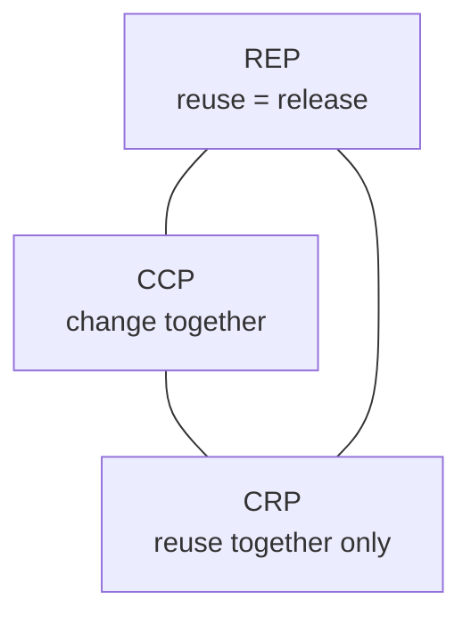

# Когезія компонентів

## Контекст

- Джерело: [[01-Sources/books/clean-architecture/Clean Architecture (Robert C. Martin)|Clean Architecture]]
- Розділ: 13
- Тип джерела: уривок

## Головна ідея

У цьому розділі Мартін переносить тему cohesion з рівня класів на рівень компонентів. Межі компонентів не можна проводити довільно "за контекстом" або за випадковою структурою каталогів; їх треба перевіряти трьома силами. `REP` вимагає, щоб одиниця повторного використання збігалася з одиницею релізу. `CCP` збирає разом класи, які змінюються з тих самих причин і в той самий час. `CRP` забороняє змушувати клієнтів залежати від класів, які їм не потрібні. Добра компонентна структура народжується не з максимізації одного з цих принципів, а з балансу між developability і reuse.

^clean-architecture-ch13-main-idea

## Ключові тези

- `REP` каже, що одиниця reuse має бути тією самою одиницею, яку команда реально релізить, версіонує й документує для користувачів. ^clean-architecture-ch13-thesis-rep
- Компонент не може бути випадковою купою класів: для автора й користувача має бути зрозуміло, чому саме ці модулі логічно випускаються разом. ^clean-architecture-ch13-thesis-release-sense
- `CCP` є компонентною формою `SRP`: класи, що змінюються з одних причин, варто тримати в одному компоненті, щоб локалізувати зміну, перевірку й перевипуск. ^clean-architecture-ch13-thesis-ccp
- `CCP` тісно пов'язаний з `OCP`, бо "закритість" тут означає стратегічне групування класів під найтиповіші сценарії змін. ^clean-architecture-ch13-thesis-ccp-ocp
- `CRP` є компонентною формою `ISP`: клієнт не повинен платити залежністю за класи, які він не використовує. ^clean-architecture-ch13-thesis-crp
- Якщо компонент містить слабо пов'язані класи, кожна дрібна зміна в ньому буде змушувати зайві залежні компоненти перевалідуватися й перевипускатися. ^clean-architecture-ch13-thesis-baggage
- `REP` і `CCP` штовхають компоненти до укрупнення, тоді як `CRP` тягне їх до зменшення; архітектор працює всередині цієї напруги, а не поза нею. ^clean-architecture-ch13-thesis-tension
- На ранніх стадіях проєкту зазвичай важливіше `CCP`, бо локалізація змін важливіша за reuse; з дозріванням системи структура може зміщуватися в бік повторного використання. ^clean-architecture-ch13-thesis-maturity

## Три принципи когезії

### `REP`: release слідує за reuse

`Reuse/Release Equivalence Principle` починається з дуже практичної вимоги: ніхто не буде серйозно повторно використовувати компонент, якщо той не має чіткої release discipline, номера версії та зрозумілої історії змін. З архітектурного боку це означає, що класи всередині компонента мають бути не просто тематично схожими, а такими, що їх справді природно випускати разом. Якщо одна частина компонента еволюціонує за одним циклом релізів, а інша за зовсім іншим, межа проведена неприродно.

^clean-architecture-ch13-rep-definition

### `CCP`: change together, stay together

`Common Closure Principle` переказує `SRP` на мові компонентів: збирай разом ті класи, які закриваються від одних і тих самих типів змін. Для application code це часто важливіше за чисту повторну використовуваність, бо дешевше перевипустити один компонент, ніж торкатися багатьох. Якщо дві групи класів майже завжди редагуються разом, рознесення їх по різних компонентах просто розмаже одну зміну по кількох релізних одиницях.

^clean-architecture-ch13-ccp-definition

### `CRP`: reuse together or separate

`Common Reuse Principle` нагадує, що залежність від компонента завжди ширша за залежність від одного класу в ньому. Якщо клієнт бере лише маленьку частину компонента, але мусить тягнути за собою купу нерелевантних класів, значить компонент занадто широкий. Тому `CRP` більше говорить про те, що не треба класти разом: слабо пов'язані класи не повинні примушувати клієнтів до спільного redeploy cycle.

^clean-architecture-ch13-crp-definition

## Діаграма напруги

Цей трикутник не про "правильний" кут, а про ціну перекосу. Якщо занадто сильно слухати лише `REP` і `CRP`, дрібні зміни почнуть розповзатися по багатьох компонентах. Якщо ж надто сильно тиснути на `REP` і `CCP`, команда отримає забагато непотрібних релізів для частин, які не мали змінюватися разом. Хороша межа компонента тимчасова й контекстна: вона має відповідати тому, як систему сьогодні змінюють і використовують.

^clean-architecture-ch13-tension-diagram

## Практичне читання для архітектури

- Перевіряй межу компонента трьома питаннями: чи логічно релізити ці класи разом, чи змінюються вони разом, і чи споживачі справді використовують їх разом.
- Якщо одна вимога регулярно зачіпає кілька компонентів, можливо, порушено `CCP`.
- Якщо новий реліз компонента часто нічого не означає для більшості його користувачів, можливо, порушено `CRP`.
- Якщо компонент важко версіонувати й пояснити його зміни одним changelog, можливо, порушено `REP`.
- Не очікуй стабільної структури назавжди: у ранньому продукті нормально оптимізуватися під локалізацію змін, а не під майбутній reuse.

## Споріднені принципи

- `CCP` є компонентним аналогом [[02-Concepts/single-responsibility-means-one-actor|SRP означає одного актора, а не одну дію]].
- `CCP` підтримує [[02-Concepts/open-closed-protects-high-level-policy|OCP захищає high-level policy через ієрархію залежностей]], бо дозволяє закривати від типових змін мінімальну кількість компонентів.
- `CRP` узагальнює [[02-Concepts/interface-segregation-avoids-dependencies-on-unused-operations|ISP ізолює клієнтів від невикористаних операцій]] з рівня інтерфейсів до рівня компонентів.

## Важливі цитати

> The granule of reuse is the granule of release.

^clean-architecture-ch13-quote-rep

> Gather together those things that change at the same times and for the same reasons.

^clean-architecture-ch13-quote-ccp

> Don’t depend on things you don’t need.

^clean-architecture-ch13-quote-crp

## Пов'язані концепти

- [[02-Concepts/component-cohesion-balances-release-change-and-reuse|Когезія компонентів балансує реліз, змінюваність і повторне використання]]
- [[01-Sources/books/clean-architecture/03-Concepts/components-are-units-of-deployment|Компоненти є одиницями розгортання]]
- [[02-Concepts/architecture-governs-cost-of-change|Архітектура визначає вартість змін]]
- [[02-Concepts/solid-organizes-modules-for-change|SOLID організовує модулі для змінюваності]]

## Джерело та продовження

- [[01-Sources/books/clean-architecture/Clean Architecture (Robert C. Martin)|Нотатка книги]]
- [[01-Sources/books/clean-architecture/02-Chapters/ch-12-components|Попередній розділ: Компоненти]]
- Із цього розділу напряму виростає [[02-Concepts/component-cohesion-balances-release-change-and-reuse|спільний концепт про баланс релізу, змінюваності й reuse на рівні компонентів]].

## Пов'язані нотатки

- [[02-Concepts/component-cohesion-balances-release-change-and-reuse#^component-cohesion-definition|Спільний концепт про баланс між `REP`, `CCP` і `CRP`]]
- [[01-Sources/books/clean-architecture/02-Chapters/ch-07-single-responsibility-principle#^clean-architecture-ch07-quote-cohesion|Цитата про cohesion як силу, що пов'язує код для одного актора]]
- [[01-Sources/books/clean-architecture/02-Chapters/ch-10-interface-segregation-principle#^clean-architecture-ch10-quote-baggage|`ISP`-формулювання про небезпеку зайвого "багажу" залежностей]]
