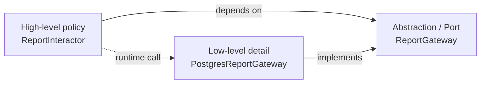

# Інверсія залежностей

## Визначення

`Dependency Inversion Principle` означає, що high-level policy не повинна прямо залежати від low-level details. Замість цього і політика, і деталі залежать від спільної абстракції, яка описує потрібний контракт. Тому напрямок виклику під час runtime може йти від use case до `database`, `UI` чи зовнішнього сервісу, але напрямок залежностей у вихідному коді буде спрямований у бік стабільнішої абстракції, а не в бік конкретної технології.

^dependency-inversion-definition

## Що саме інвертується

У цьому принципі інвертується не порядок виконання програми, а напрямок залежностей у коді.

- Без `DIP` високорівневий модуль зазвичай імпортує низькорівневий: `ReportService -> PostgresClient`.
- З `DIP` високорівневий модуль залежить від порту або інтерфейсу: `ReportService -> ReportRepository`.
- Конкретна деталь уже підлаштовується під цей контракт: `PostgresReportRepository -> ReportRepository`.

Тобто керування все ще починається з бізнес-сценарію, але кодова залежність більше не тягне сценарій у бік деталей.

## Як це читати на простій схемі



Схема читається так:

- `Policy` знає лише про `Port`.
- `Detail` теж знає про `Port`, бо мусить реалізувати його контракт.
- Під час виконання `Policy` справді користується `Detail`, але не через прямий імпорт конкретного класу, а через абстракцію.

Саме це і є інверсією: потік керування може йти донизу, а залежності в коді спрямовані всередину, до стабільнішого контракту.

## Чому це важливо

`DIP` дає практичний спосіб захистити бізнес-логіку від ерозії через фреймворки, `database`, `UI` та інфраструктурні рішення. Якщо залежності спрямовані до стабільних правил, то зміна деталей не тягне за собою ланцюгового редагування всередині ядра. Саме тому цей принцип напряму підтримує `OCP`: нові адаптери можна додавати без переписування high-level policy.

## Стабільні абстракції

Розділ 11 у `Clean Architecture` уточнює, що `DIP` не варто читати як заборону на будь-яку concrete залежність. Його справжня ціль - уникати саме volatile concretions. Стабільні платформні типи на кшталт `String` ми зазвичай терпимо, бо вони змінюються рідко й не диктують форму бізнес-правил. Натомість власні реалізації, фреймворки, драйвери та інші active details варто тримати поза ядром policy.

- Абстракції зазвичай стабільніші за реалізації: інтерфейс змінюється рідше, бо кожна його правка тягне хвилю змін по всіх імплементаціях.
- Добрий контракт дозволяє розвивати реалізації без постійного редагування самого інтерфейсу.
- Якщо high-level policy залежить від нестабільної конкретики, вартість змін починає текти з периферії в центр системи.

^dependency-inversion-stable-abstractions

## Інтуїція

Найпростіша ментальна модель така: не бізнес-логіка має "говорити мовою бази даних", а база даних має "вивчити мову бізнес-логіки".

- Якщо use case каже: "мені потрібен спосіб зберегти звіт", то він має оголосити контракт `SaveReport`.
- `Postgres`, `SQLite`, `HTTP API` або `in-memory fake` уже підлаштовуються під цей контракт.
- Тоді технологія стає змінною деталлю, а use case лишається стабільним центром.

## Спрощений приклад

Уявімо сценарій побудови фінансового звіту:

- `FinancialReportInteractor` формує звіт.
- Йому потрібні дані, але він не повинен знати, чи вони прийшли з `Postgres`, `CSV`, `REST API` чи тестового `fake`.
- Тому він залежить від `FinancialDataGateway`.
- `PostgresFinancialDataGateway` реалізує цей контракт окремо.

Якщо завтра сховище зміниться, ми замінимо адаптер. Якщо зміниться бізнес-правило побудови звіту, ми редагуватимемо interactor. Це і є розділення політики та деталей через `DIP`.

## Мінімальний приклад коду

```java
public interface FinancialDataGateway {
    ReportData fetchReportData();
}

public final class FinancialReportInteractor {
    private final FinancialDataGateway gateway;

    public FinancialReportInteractor(FinancialDataGateway gateway) {
        this.gateway = gateway;
    }

    public ReportData buildReport() {
        return gateway.fetchReportData();
    }
}

public final class PostgresFinancialDataGateway implements FinancialDataGateway {
    public ReportData fetchReportData() {
        return loadFromPostgres();
    }
}
```

`FinancialReportInteractor` залежить лише від `FinancialDataGateway`, а конкретний `Postgres`-адаптер залежить від цього контракту й реалізує його. Потік виклику під час runtime йде до бази даних, але вихідна кодова залежність high-level policy спрямована в бік абстракції. ^dependency-inversion-minimal-code-example

## Ознаки в коді

- Інтерфейс або абстракція живе поруч із high-level policy, а concrete implementation імпортує цей контракт, а не навпаки.
- Потік викликів іде в один бік, а імпорт залежностей у коді може йти в інший.
- `UI`, `database`, транспорт чи зовнішні драйвери можна замінювати як адаптери, не торкаючись ядра правил.
- Use case можна протестувати без підняття справжньої бази даних або веб-фреймворку.
- Назви контрактів описують мову сценарію (`LoadOrders`, `PaymentGateway`, `UserPresenter`), а не мову конкретної технології.

## Симптоми порушення

- Бізнес-сценарій напряму імпортує `ORM`, `HTTP client`, `framework controller` або SDK зовнішнього сервісу.
- Доменні моделі починають містити анотації, типи або винятки інфраструктурного фреймворку.
- Неможливо написати швидкий тест use case без реальної бази, мережі або контейнера застосунку.
- Заміна сховища або `UI` вимагає змін у бізнес-логіці замість додавання нового адаптера.

## Практичне правило

Коли сумніваєшся, став собі два питання:

1. Хто тут policy, а хто detail?
2. Чий код має знати про чий контракт?

Якщо policy знає про деталь, архітектура тече назовні. Якщо detail знає про контракт policy, залежності спрямовані правильно.

Окремо пам'ятай про створення об'єктів: `new ConcreteType(...)` майже завжди означає залежність від detail. Тому concrete wiring зазвичай живе в `main`, composition root або `Abstract Factory`, а не всередині use case-у.

## Джерела

- [[01-Sources/books/clean-architecture/02-Chapters/ch-11-dependency-inversion-principle#^clean-architecture-ch11-main-idea]]
- [[01-Sources/books/clean-architecture/02-Chapters/ch-11-dependency-inversion-principle#^clean-architecture-ch11-thesis-stable-abstractions]]
- [[01-Sources/books/clean-architecture/02-Chapters/ch-05-object-oriented-programming#^clean-architecture-ch05-thesis-indirect-control]]
- [[01-Sources/books/clean-architecture/02-Chapters/ch-05-object-oriented-programming#^clean-architecture-ch05-thesis-dependency-inversion]]
- [[01-Sources/books/clean-architecture/02-Chapters/ch-05-object-oriented-programming#^clean-architecture-ch05-thesis-independent-components]]
- [[01-Sources/books/clean-architecture/02-Chapters/ch-05-object-oriented-programming#^clean-architecture-ch05-quote-definition]]

## Пов'язані концепти

- [[02-Concepts/plugin-architecture-via-polymorphism|Поліморфізм дозволяє будувати plugin architecture]]
- [[01-Sources/books/clean-architecture/03-Concepts/oo-controls-dependency-direction-through-polymorphism|ООП дає контроль над напрямком залежностей через поліморфізм]]
- [[02-Concepts/architecture-governs-cost-of-change|Архітектура визначає вартість змін]]

## Пов'язані фрагменти

- [[01-Sources/books/clean-architecture/02-Chapters/ch-11-dependency-inversion-principle#^clean-architecture-dip-code-policy-port|Interactor залежить від gateway-контракту, а не від Postgres]]
- [[01-Sources/books/clean-architecture/02-Chapters/ch-05-object-oriented-programming#^clean-architecture-ch05-code-function-pointers|Вказівники на функції в C як основа поліморфізму]]
