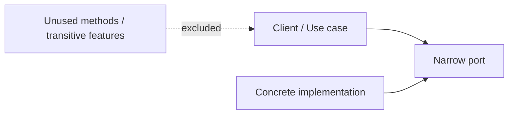

# ISP ізолює клієнтів від невикористаних операцій

## Визначення

`Interface Segregation Principle` означає, що клієнт має залежати лише від того контракту, який покриває його реальну потребу. Якщо модуль, клас або сервіс змушує клієнта знати про додаткові методи, поля, формати або залежності, яких той не використовує, то контракт занадто широкий. `ISP` зменшує таке зчеплення, відокремлюючи ролі клієнтів і даючи кожній ролі мінімально достатній інтерфейс.

^interface-segregation-definition

## Чому це важливо

Широкі контракти збільшують вартість змін навіть тоді, коли функціонально нічого не ламається для конкретного клієнта. У статично типізованих мовах це проявляється як зайві імпорти, перекомпіляція та redeploy. На архітектурному рівні наслідок той самий, але масштаб більший: фреймворк, SDK або база даних можуть протягнути в систему непотрібний функціонал, непотрібні деплойти та непотрібні збої.

## Як це читати в коді

- Один сервіс часто має кілька ролей, але кожен клієнт зазвичай використовує лише невеликий піднабір його можливостей.
- Тому корисно відділяти `ReadPort`, `WritePort`, `AdminPort`, `ReportingPort` або інші role-based контракти замість одного "універсального" API.
- Одна concrete-реалізація може реалізовувати кілька вузьких інтерфейсів; `ISP` не вимагає множити реалізації, він вимагає звузити залежності клієнтів.

## Архітектурне читання

`ISP` важливий не лише для сигнатур методів. Якщо `core` системи залежить від фреймворку, який своєю чергою жорстко пов'язаний з конкретною базою, чергою чи хмарним SDK, то разом із корисною можливістю ми приймаємо й увесь чужий багаж. Саме тому цей принцип добре поєднується з портами й адаптерами: стабільна частина системи формулює маленький контракт, а велика інфраструктурна деталь залишається за межами цього контракту.

## Спрощена схема



Суть проста: клієнт має бачити лише вузький порт, а не весь набір можливостей реалізації або її транзитивних залежностей. ^interface-segregation-simple-diagram

## Ознаки в коді

- Інтерфейс містить багато методів, але кожен клієнт реально викликає лише 1-2 з них.
- Після зміни однієї операції доводиться запускати перевірки, rebuild або redeploy модулів, які цю операцію не використовують.
- Клієнти змушені залежати від фреймворкових типів, винятків або конфігурацій, хоча їм потрібна тільки одна проста дія.
- Для тестів доводиться мокати велику кількість непотрібних методів, щоб підготувати один сценарій.

## Практичні евристики

- Проєктуй контракти від споживача: "що саме потрібно цьому клієнту?" важливіше за "що все вміє ця реалізація?".
- Якщо інтерфейс складно повністю назвати одним іменником або роллю, він часто вже занадто широкий.
- Якщо одна залежність тягне за собою великий набір чужих модулів, розглянь фасад, адаптер або власний порт.
- Не виправдовуй широкий контракт тим, що мова динамічна: runtime coupling і архітектурний багаж нікуди не зникають.

## Мінімальний приклад

```java
public interface ReportReader {
    Report load(String id);
}

public final class ReportPage {
    private final ReportReader reader;

    public ReportPage(ReportReader reader) {
        this.reader = reader;
    }
}
```

`ReportPage` не повинен залежати від методів `deleteReport`, `reindexAllReports` або `exportAuditLog`, якщо його єдина потреба - читання звіту. ^interface-segregation-minimal-code-example

## Джерела

- [[01-Sources/books/clean-architecture/02-Chapters/ch-10-interface-segregation-principle#^clean-architecture-ch10-main-idea]]
- [[01-Sources/books/clean-architecture/02-Chapters/ch-10-interface-segregation-principle#^clean-architecture-ch10-thesis-segregated-interfaces]]
- [[01-Sources/books/clean-architecture/02-Chapters/ch-10-interface-segregation-principle#^clean-architecture-ch10-thesis-architecture]]
- [[01-Sources/books/clean-architecture/02-Chapters/ch-10-interface-segregation-principle#^clean-architecture-ch10-thesis-baggage]]

## Пов'язані концепти

- [[02-Concepts/solid-organizes-modules-for-change|SOLID організовує модулі для змінюваності]]
- [[02-Concepts/dependency-inversion|Інверсія залежностей]]
- [[02-Concepts/open-closed-protects-high-level-policy|OCP захищає high-level policy через ієрархію залежностей]]
- [[02-Concepts/liskov-substitution-preserves-client-behavior|LSP зберігає поведінку клієнта при підстановці]]
