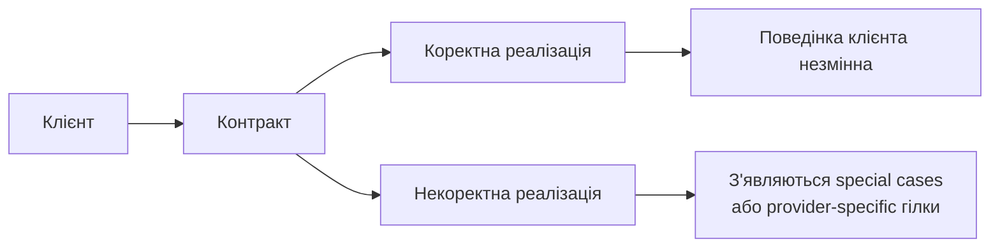

# LSP зберігає поведінку клієнта при підстановці

## Визначення

`Liskov Substitution Principle` означає, що клієнт, написаний проти певного контракту, має працювати однаково, коли ми підставляємо будь-яку коректну реалізацію цього контракту. Ключ тут не в формальній сумісності сигнатур, а в збереженні очікуваної поведінки, інваріантів і семантики, на які спирається клієнтський код.

^liskov-substitution-preserves-client-behavior-definition

## Чому це важливо

`LSP` не дає архітектурі текти у бік особливих випадків. Щойно одна "нібито сумісна" реалізація вимагає окремої гілки, перевірки типу або постачальник-специфічної збірки запиту, клієнт перестає залежати від контракту й починає залежати від конкретних деталей. Саме так локальна несумісність перетворюється на архітектурне забруднення.

## Ознаки в коді

- Клієнт використовує реалізації через спільний контракт без `if/else`, `instanceof` або provider-specific логіки.
- Реалізації дотримуються однакових передумов, постумов, інваріантів і поведінкових очікувань, а не лише однакових назв методів.
- Заміна однієї реалізації на іншу не змушує міняти тести клієнта, окрім, можливо, test data.

## Типові симптоми порушення

- Підтип звужує або ламає очікувану поведінку базового типу, як у `Square/Rectangle`.
- Один провайдер того самого API змінює semantics полів, кодів або сценаріїв обробки, і клієнт мусить це знати.
- У системі з'являються "тимчасові" конфігурації або адаптери лише для того, щоб приховати контрактну несумісність, яка мала б бути неможливою на рівні абстракції.

## Схема підстановності

Граф зводить `LSP` до однієї перевірки: якщо підстановка штовхає клієнта в окремі гілки логіки, то проблема в реалізації або в самому контракті, а не в клієнті. ^liskov-substitution-preserves-client-behavior-diagram

## Практичне читання

Коли перевіряєш новий subtype або implementation, запитуй не "чи компілюється це проти того самого інтерфейсу?", а "чи залишаються валідними всі припущення клієнта?". Якщо відповідь ні, то проблема не в клієнті, а в тому, що контракт сформульований неправильно або нова реалізація не є коректною підстановкою.

## Джерела

- [[01-Sources/books/clean-architecture/02-Chapters/ch-09-liskov-substitution-principle#^clean-architecture-ch09-main-idea]]
- [[01-Sources/books/clean-architecture/02-Chapters/ch-09-liskov-substitution-principle#^clean-architecture-ch09-thesis-definition]]
- [[01-Sources/books/clean-architecture/02-Chapters/ch-09-liskov-substitution-principle#^clean-architecture-ch09-thesis-special-cases]]
- [[01-Sources/books/clean-architecture/02-Chapters/ch-09-liskov-substitution-principle#^clean-architecture-ch09-thesis-taxi]]
- [[01-Sources/books/clean-architecture/02-Chapters/ch-09-liskov-substitution-principle#^clean-architecture-ch09-quote-liskov]]

## Пов'язані концепти

- [[02-Concepts/open-closed-protects-high-level-policy|OCP захищає high-level policy через ієрархію залежностей]]
- [[02-Concepts/dependency-inversion|Інверсія залежностей]]
- [[02-Concepts/solid-organizes-modules-for-change|SOLID організовує модулі для змінюваності]]
- [[01-Sources/books/clean-architecture/03-Concepts/oo-controls-dependency-direction-through-polymorphism|ООП дає контроль над напрямком залежностей через поліморфізм]]

## Пов'язаний код

- [[01-Sources/books/clean-architecture/02-Chapters/ch-09-liskov-substitution-principle#^clean-architecture-ch09-minimal-code-example|Мінімальний приклад з Rectangle/Square]]
