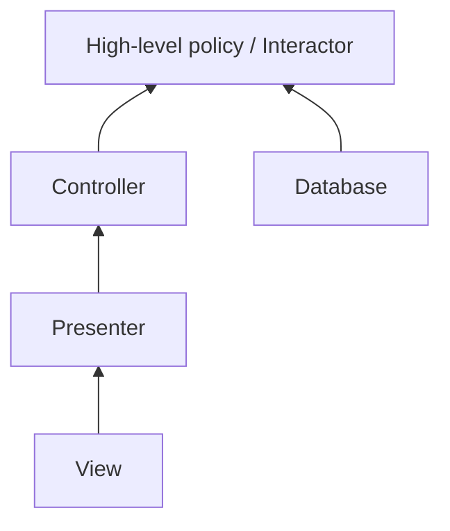

# OCP захищає high-level policy через ієрархію залежностей

## Визначення

На архітектурному рівні `Open-Closed Principle` означає не абстрактну "розширюваність" сама по собі, а таку організацію компонентів, у якій higher-level policy захищена від змін у lower-level деталях. Нові способи presentation, integration чи storage додаються як розширення на периферії, тоді як ядро бізнес-правил залишається закритим для модифікації саме завдяки напрямку залежностей.

^open-closed-protects-high-level-policy-definition

## Чому це важливо

Цей концепт переводить `OCP` з рівня локального дизайну класу на рівень реальної системної економіки. Його цінність не в тому, що "ми не любимо змінювати старі файли", а в тому, що зміна периферійної вимоги не повинна пробивати каскад правок у policy layer. Саме так архітектура зменшує impact of change і робить розширення передбачуваним.

## Ознаки в коді

- Компоненти presentation, transport, `database` або інші адаптери залежать від інтерфейсів, визначених ближче до business rules, а не навпаки.
- Додавання нового каналу виводу чи нового способу збереження даних здебільшого вимагає нових реалізацій, а не редагування core use case.
- Higher-level компонент не просвічує свої внутрішні сутності назовні без потреби; зовнішні шари бачать лише потрібні контракти.

## Спрощена схема

Сенс схеми такий: периферія може змінюватися й розширюватися, але залежить у бік policy layer, яку ми хочемо тримати закритою для модифікації. ^open-closed-protects-high-level-policy-diagram

## Джерела

- [[01-Sources/books/clean-architecture/02-Chapters/ch-08-open-closed-principle#^clean-architecture-ch08-main-idea]]
- [[01-Sources/books/clean-architecture/02-Chapters/ch-08-open-closed-principle#^clean-architecture-ch08-thesis-unidirectional]]
- [[01-Sources/books/clean-architecture/02-Chapters/ch-08-open-closed-principle#^clean-architecture-ch08-thesis-interactor]]
- [[01-Sources/books/clean-architecture/02-Chapters/ch-08-open-closed-principle#^clean-architecture-ch08-thesis-information-hiding]]
- [[01-Sources/books/clean-architecture/02-Chapters/ch-08-open-closed-principle#^clean-architecture-ch08-quote-protection]]

## Пов'язані концепти

- [[02-Concepts/dependency-inversion|Інверсія залежностей]]
- [[02-Concepts/single-responsibility-means-one-actor|SRP означає одного актора, а не одну дію]]
- [[02-Concepts/architecture-governs-cost-of-change|Архітектура визначає вартість змін]]
- [[02-Concepts/solid-organizes-modules-for-change|SOLID організовує модулі для змінюваності]]

## Пов'язаний код

- Конкретні code notes для цього спільного концепту ще не додані.
