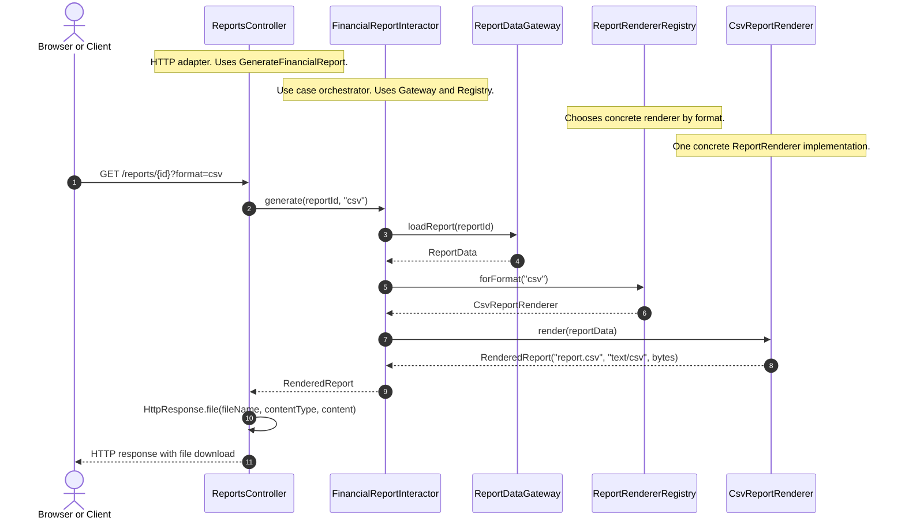

# Як дотримуватись SOLID у коді

## Коли використовувати

Цей playbook підходить для design review, refactoring, code review і будь-якої задачі, де потрібно перевірити, чи витримає модуль нові вимоги без зайвого зчеплення, ламких контрактів і протікання інфраструктурних деталей у бізнес-логіку.

## Коротка ідея

`SOLID` варто читати не як п'ять ізольованих "правил для класів", а як один маршрут перевірки змінюваності модуля. Спершу ми проводимо межу відповідальності через актора (`SRP`), потім захищаємо стабільне ядро від правок через розширення (`OCP`), перевіряємо взаємозамінність реалізацій (`LSP`), звужуємо контракти під реальні потреби клієнтів (`ISP`) і нарешті спрямовуємо залежності до стабільних абстракцій, а не до volatile details (`DIP`).

## Робочий порядок

1. Назви модуль, який змінюєш, і сформулюй його головний use case або policy. Якщо це зробити важко, межа модуля вже може бути нечіткою. ^solid-playbook-step-1
2. Визнач, хто саме тисне на цей код змінами: один актор чи кілька незалежних ролей, команд або сценаріїв. Якщо причин для змін кілька, починай із `SRP` і розділення відповідальностей. ^solid-playbook-step-2
3. Познач, що в модулі є policy, а що є detail: алгоритм, бізнес-правило, use case, формат виводу, база даних, SDK, фреймворк, транспорт. Це підкаже, що саме має лишатися стабільним. ^solid-playbook-step-3
4. Подивися, чи нова вимога додається через нову реалізацію або адаптер, чи змушує переписувати стабільне ядро. Якщо без редагування ядра не обійтися, перевір `OCP` і напрямок залежностей. ^solid-playbook-step-4
5. Перевір, чи клієнти справді залежать від контрактів, а не від особливостей конкретних реалізацій. Будь-який `if provider == x`, `instanceof` або окрема гілка під subtype є червоним прапорцем для `LSP`. ^solid-playbook-step-5
6. Переглянь контракти очима споживача: кожен клієнт має бачити лише потрібний порт, а не весь набір можливостей реалізації. Якщо клієнт мокaє або імпортує більше, ніж використовує, перевір `ISP`. ^solid-playbook-step-6
7. Перевір імпорти й створення об'єктів: якщо use case знає про `ORM`, `HTTP client`, `framework controller` або `new ConcreteType(...)`, архітектура, імовірно, порушує `DIP`. ^solid-playbook-step-7
8. Після змін проганяй тести не лише на коректність поведінки, а й на замінність реалізацій, незалежність клієнтів і можливість тестувати policy без реальної інфраструктури. ^solid-playbook-step-8

## Практичний чекліст по принципах

### SRP: одна причина для зміни

- Питай не "чи робить модуль одну річ?", а "перед ким цей модуль відповідальний?".
- Якщо один файл регулярно чіпають різні команди або різні use case-и, це сильний сигнал змішаної відповідальності.
- Не поспішай виносити спільний helper, якщо збіг формули приховує різний бізнесовий сенс.
- Після розділення можна повернути ergonomic API через фасад, але самі алгоритмічні відповідальності мають лишитися розведеними.

[[02-Concepts/single-responsibility-means-one-actor|SRP означає одного актора, а не одну дію]]

### OCP: розширюй периферію, не ламай ядро

- Спочатку визнач, який код є high-level policy і має бути найдорожчим для змін.
- Нові канали виводу, нові інтеграції, нові способи збереження або доставки даних мають приходити як нові адаптери, presenters, handlers чи implementations.
- Якщо додавання нового сценарію змушує редагувати стабільний use case у кількох місцях, модуль поки що погано захищений від змін.
- `OCP` майже завжди спирається на вже проведені межі `SRP` і на правильний напрямок залежностей із `DIP`.

[[02-Concepts/open-closed-protects-high-level-policy|OCP захищає high-level policy через ієрархію залежностей]]

### LSP: реалізації мають бути справді взаємозамінними

- Дивись не лише на сигнатури, а на поведінку, інваріанти, коди помилок, назви полів і допустимі стани.
- Якщо нова реалізація вимагає special-case логіки в клієнті, то проблема майже напевно в контракті або в самій реалізації, а не в клієнті.
- Хороший тест на `LSP`: чи залишаються тести клієнта валідними, якщо підмінити одну реалізацію іншою.
- Якщо підтип послаблює гарантії базового типу або додає приховані побічні ефекти, це не extension, а злам підстановності.

[[02-Concepts/liskov-substitution-preserves-client-behavior|LSP зберігає поведінку клієнта при підстановці]]

### ISP: клієнт має бачити лише свій контракт

- Формуй інтерфейси навколо ролі клієнта або use case-у, а не навколо повного набору можливостей сервісу.
- Один concrete-клас може реалізовувати кілька вузьких портів; `ISP` не вимагає множити реалізації, він вимагає звужувати залежності.
- Якщо для тесту доводиться мокати багато непотрібних методів, інтерфейс занадто широкий.
- Якщо ядро залежить від важкого фреймворку чи SDK лише заради невеликої частини його можливостей, сховай це за власним портом або фасадом.

[[02-Concepts/interface-segregation-avoids-dependencies-on-unused-operations|ISP ізолює клієнтів від невикористаних операцій]]

### DIP: policy диктує контракт, а detail підлаштовується

- Контракти формулюй мовою use case-ів: `ReportReader`, `PaymentGateway`, `UserPresenter`, а не мовою технології.
- High-level code не повинен напряму імпортувати `database`, `framework`, `SDK` чи transport details.
- `new ConcreteType(...)`, конфігурація і вибір реалізації мають жити в `main`, composition root або factory.
- Хороший тест на `DIP`: чи можеш ти перевірити use case без реальної бази, мережі або контейнера застосунку.

[[02-Concepts/dependency-inversion|Інверсія залежностей]]

## Швидкий маршрут рефакторингу

1. Зафіксуй конкретний сценарій зміни: що саме потрібно додати або виправити.
2. Назви policy, яка не повинна випадково ламатися від цієї зміни.
3. Розріж змішані відповідальності за акторами або причинами змін.
4. Виділи мінімальний контракт, потрібний клієнту або use case-у.
5. Підлаштуй нову реалізацію під цей контракт, а не розширюй клієнта умовною логікою.
6. Перенеси concrete wiring на периферію системи.
7. Додай або онови тести на замінність реалізацій і на ізольоване тестування policy.

## Симуляція фічі: додаємо CSV-експорт фінансового звіту

Уявімо запит на фічу: зараз система вміє показувати фінансовий звіт у web-інтерфейсі, а тепер продуктова команда просить додати `CSV export`, щоб фінансовий відділ міг вивантажувати дані в `Excel`.

### Поганий перший імпульс

Найтиповіший "швидкий" патч виглядає так:

```java showLineNumbers title="ReportsService.java"
public final class ReportsService {
    private final PostgresClient postgres;

    public HttpResponse generateReport(String reportId, String format) {
        ReportData data = postgres.loadReport(reportId);

        if (format.equals("html")) {
            return HttpResponse.ok(renderHtml(data));
        }

        if (format.equals("csv")) {
            auditExport(reportId);
            return HttpResponse.file("report.csv", "text/csv", renderCsv(data));
        }

        throw new IllegalArgumentException("Unknown format");
    }

    public void deleteReport(String reportId) { ... }
    public void reindexReports() { ... }
}
```

Тут майже все змішано в одному місці: читання з `Postgres`, бізнесовий сценарій побудови звіту, вибір формату, `HTTP`-відповідь, аудит експорту й ще й admin-методи поруч. Такий код наче швидкий, але саме він робить наступну фічу дорожчою за попередню.

### SOLID-варіант тієї самої фічі

Спершу фіксуємо policy: use case має "зібрати дані звіту і відрендерити їх у вибраному форматі". Нижче один цілісний приклад: спочатку контракти, потім concrete-реалізації, а в кінці composition root, де все реально збирається разом.

```java showLineNumbers
public record ReportData(String title, BigDecimal revenue) {}

public record RenderedReport(
    String fileName,
    String contentType,
    byte[] content
) {}

public interface ReportDataGateway {
    ReportData loadReport(String reportId);
}

public interface ReportRenderer {
    RenderedReport render(ReportData data);
}

public interface ReportRendererRegistry {
    ReportRenderer forFormat(String format);
}

public interface GenerateFinancialReport {
    RenderedReport generate(String reportId, String format);
}

public interface PostgresClient {
    Row querySingle(String sql, String reportId);
}

public record Row(String title, BigDecimal revenue) {}

public final class FinancialReportInteractor implements GenerateFinancialReport {
    private final ReportDataGateway gateway;
    private final ReportRendererRegistry renderers;

    public FinancialReportInteractor(
        ReportDataGateway gateway,
        ReportRendererRegistry renderers
    ) {
        this.gateway = gateway;
        this.renderers = renderers;
    }

    @Override
    public RenderedReport generate(String reportId, String format) {
        ReportData data = gateway.loadReport(reportId);
        ReportRenderer renderer = renderers.forFormat(format);
        return renderer.render(data);
    }
}

public final class HtmlReportRenderer implements ReportRenderer {
    @Override
    public RenderedReport render(ReportData data) {
        return new RenderedReport("report.html", "text/html", renderHtml(data));
    }
}

public final class CsvReportRenderer implements ReportRenderer {
    @Override
    public RenderedReport render(ReportData data) {
        return new RenderedReport("report.csv", "text/csv", renderCsv(data));
    }
}

public final class PostgresReportDataGateway implements ReportDataGateway {
    private final PostgresClient postgres;

    public PostgresReportDataGateway(PostgresClient postgres) {
        this.postgres = postgres;
    }

    @Override
    public ReportData loadReport(String reportId) {
        Row row = postgres.querySingle(
            "select title, revenue from reports where id = ?",
            reportId
        );
        return new ReportData(row.title(), row.revenue());
    }
}

public final class InMemoryReportRendererRegistry implements ReportRendererRegistry {
    private final Map<String, ReportRenderer> renderers;

    public InMemoryReportRendererRegistry(Map<String, ReportRenderer> renderers) {
        this.renderers = renderers;
    }

    @Override
    public ReportRenderer forFormat(String format) {
        ReportRenderer renderer = renderers.get(format);

        if (renderer == null) {
            throw new IllegalArgumentException("Unsupported format: " + format);
        }

        return renderer;
    }
}

public final class ReportsController {
    private final GenerateFinancialReport generateFinancialReport;

    public ReportsController(GenerateFinancialReport generateFinancialReport) {
        this.generateFinancialReport = generateFinancialReport;
    }

    public HttpResponse download(String reportId, String format) {
        RenderedReport report = generateFinancialReport.generate(reportId, format);
        return HttpResponse.file(
            report.fileName(),
            report.contentType(),
            report.content()
        );
    }
}

public final class Application {
    public static void main(String[] args) {
        PostgresClient postgresClient = new RealPostgresClient();

        ReportDataGateway gateway =
            new PostgresReportDataGateway(postgresClient);

        ReportRenderer htmlRenderer = new HtmlReportRenderer();
        ReportRenderer csvRenderer = new CsvReportRenderer();

        ReportRendererRegistry registry =
            new InMemoryReportRendererRegistry(
                Map.of(
                    "html", htmlRenderer,
                    "csv", csvRenderer
                )
            );

        GenerateFinancialReport useCase =
            new FinancialReportInteractor(gateway, registry);

        ReportsController controller =
            new ReportsController(useCase);

        HttpResponse response = controller.download("report-42", "csv");

        sendToBrowser(response);
    }
}
```

У цьому фрагменті вже видно повний ланцюг без розривів: зверху оголошені контракти, нижче йдуть concrete-реалізації `FinancialReportInteractor`, `HtmlReportRenderer`, `CsvReportRenderer`, `PostgresReportDataGateway`, `InMemoryReportRendererRegistry` і `ReportsController`, а в самому кінці `Application` збирає все докупи й викликає `controller.download("report-42", "csv")`.

### Фінальний flow



Це runtime flow. Його варто читати зверху вниз: клієнт надсилає `HTTP request`, `ReportsController` приймає transport-level дані, `FinancialReportInteractor` запускає use case, `ReportDataGateway` дістає `ReportData`, `ReportRendererRegistry` підбирає потрібний renderer, `CsvReportRenderer` будує `RenderedReport`, а controller наприкінці перетворює цей результат у `HttpResponse`.

### Як тут проявляється кожен принцип

- `SRP`: `FinancialReportInteractor` оркеструє use case, `PostgresReportDataGateway` читає дані, `CsvReportRenderer` відповідає за формат, а `ReportsController` за `HTTP`. У кожного модуля свій актор змін.
- `OCP`: щоб додати `XLSX`-експорт, ми створюємо `XlsxReportRenderer` і реєструємо його на периферії. Ядро use case не треба переписувати.
- `LSP`: `HtmlReportRenderer`, `CsvReportRenderer` і майбутній `XlsxReportRenderer` мають повертати один і той самий контракт `RenderedReport`. Клієнт не повинен знати, який саме renderer стоїть за цим.
- `ISP`: `ReportsController` залежить від вузького `GenerateFinancialReport`, а не від товстого `ReportsService`, де поруч живуть `deleteReport`, `reindexReports` і інші непотрібні операції.
- `DIP`: interactor залежить від `ReportDataGateway` і `ReportRendererRegistry`, а не від `PostgresClient` чи конкретного CSV-класу. Concrete wiring живе в composition root.

### Що змінюється, коли приходить наступна фіча

Тепер уявімо другу вимогу: "додайте ще `XLSX export`". У слабкому дизайні ми знову ліземо в той самий `if/else`-ланцюг і ризикуємо зачепити `HTML` або аудит. У `SOLID`-варіанті сценарій спокійніший:

1. Додаємо `XlsxReportRenderer implements ReportRenderer`.
2. Реєструємо його у `ReportRendererRegistry`.
3. Додаємо тести, що `GenerateFinancialReport` однаково працює з `html`, `csv` і `xlsx`.
4. Не торкаємося `FinancialReportInteractor`, якщо policy не змінилася.

Саме так одна фіча демонструє весь сенс `SOLID`: ми не просто "розбили код на класи", а зробили так, щоб наступна зміна приходила в очікуване місце й не руйнувала решту системи.

## Сигнали успіху

- Новий сценарій найчастіше додається через новий адаптер, presenter, handler або implementation, а не через каскад правок у ядро.
- Use case можна прочитати без знання конкретної бази даних, фреймворку чи SDK.
- Клієнти працюють через невеликі контракти і не знають про зайві операції.
- Підміна реалізації не вимагає `if/else` або зміни клієнтських тестів.
- Межі модулів можна пояснити через акторів, policy і причини для змін, а не лише через назви сутностей.

## Типові помилки

- Тлумачити `SRP` як вимогу "кожен клас має робити одну дрібну дію" замість перевірки на одного актора.
- Зводити `OCP` до сліпого додавання інтерфейсів без реального захисту policy.
- Перевіряти `LSP` лише на сумісність сигнатур і не дивитися на поведінковий контракт.
- Робити один "універсальний" сервісний інтерфейс і вважати це достатньою абстракцією.
- Ховати прямі concrete залежності за service locator або контейнером, але лишати policy залежною від інфраструктурної мови.

## Пов'язані концепти

- [[02-Concepts/solid-organizes-modules-for-change|SOLID організовує модулі для змінюваності]]
- [[02-Concepts/single-responsibility-means-one-actor|SRP означає одного актора, а не одну дію]]
- [[02-Concepts/open-closed-protects-high-level-policy|OCP захищає high-level policy через ієрархію залежностей]]
- [[02-Concepts/liskov-substitution-preserves-client-behavior|LSP зберігає поведінку клієнта при підстановці]]
- [[02-Concepts/interface-segregation-avoids-dependencies-on-unused-operations|ISP ізолює клієнтів від невикористаних операцій]]
- [[02-Concepts/dependency-inversion|Інверсія залежностей]]

## Джерела

- [[01-Sources/books/clean-architecture/02-Chapters/ch-p3-design-principles#^clean-architecture-p3-thesis-five-principles]]
- [[01-Sources/books/clean-architecture/02-Chapters/ch-07-single-responsibility-principle#^clean-architecture-ch07-thesis-one-actor]]
- [[01-Sources/books/clean-architecture/02-Chapters/ch-08-open-closed-principle#^clean-architecture-ch08-thesis-srp-dip]]
- [[01-Sources/books/clean-architecture/02-Chapters/ch-09-liskov-substitution-principle#^clean-architecture-ch09-thesis-special-cases]]
- [[01-Sources/books/clean-architecture/02-Chapters/ch-10-interface-segregation-principle#^clean-architecture-ch10-thesis-minimal-contracts]]
- [[01-Sources/books/clean-architecture/02-Chapters/ch-11-dependency-inversion-principle#^clean-architecture-ch11-thesis-rules]]
